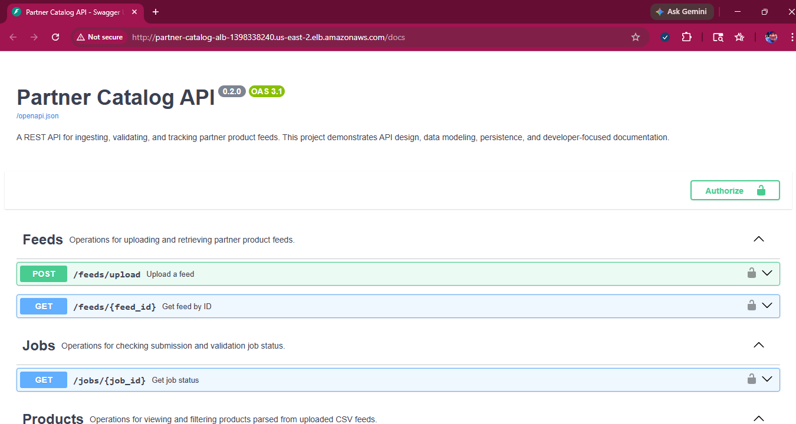
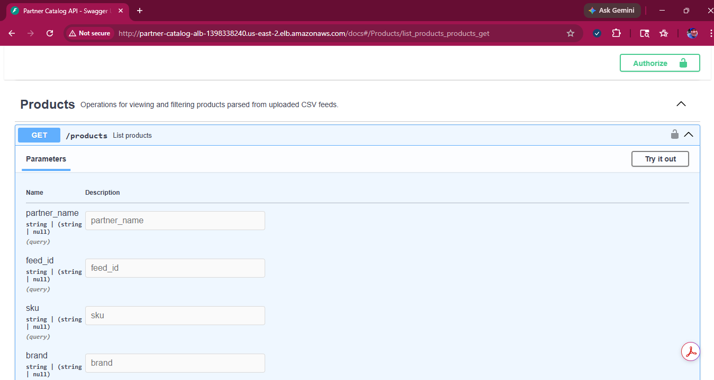
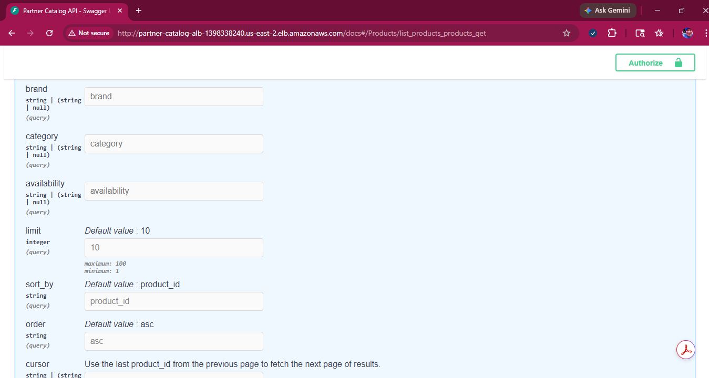
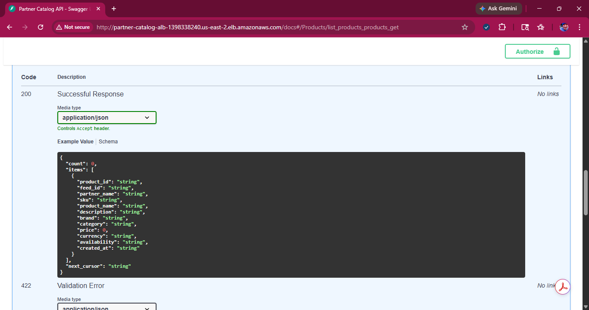
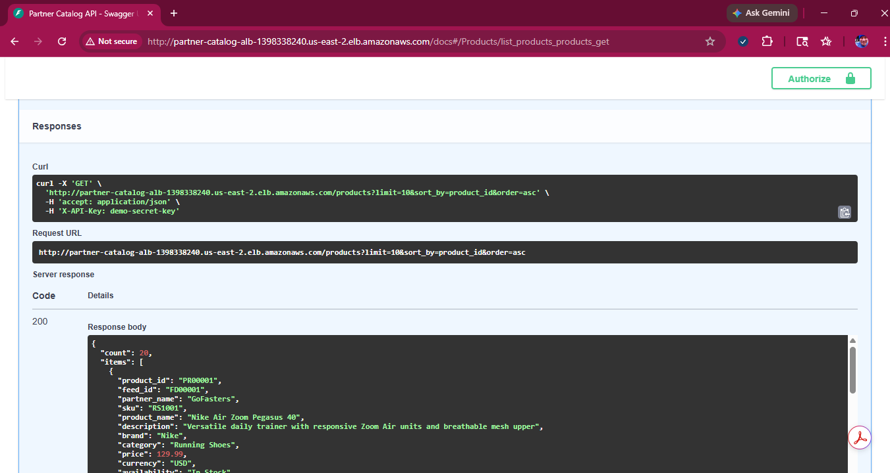
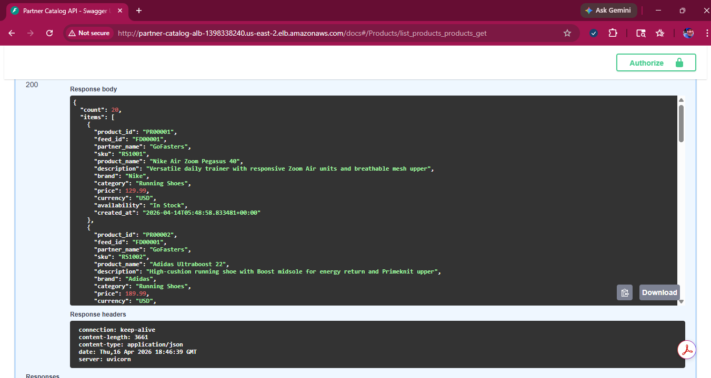

# Partner Catalog API

A demo REST API for ingesting, validating, and querying product data from multiple partner feeds.

This project demonstrates API design, data modeling, cloud deployment, and developer-focused documentation for a multi-partner catalog platform.

---

## Live API

> Note: The live demo may be temporarily offline to control cloud costs.

* Swagger UI:
  http://partner-catalog-alb-1398338240.us-east-2.elb.amazonaws.com/docs

---

## Overview

The Partner Catalog API simulates a real-world e-commerce ingestion pipeline where external partners submit product data feeds that are processed and made available for querying.

Designed to reflect multi-partner catalog ingestion systems used by platforms like Amazon Marketplace and enterprise e-commerce solutions.

### Key capabilities

* Feed ingestion via CSV upload
* Job-based processing and validation tracking
* Product storage and retrieval
* Filtering, sorting, and pagination
* API key-based authentication

---

## API Documentation (Live)

The API is deployed to AWS and accessible via Swagger UI.

### Swagger Overview


---

### Products Endpoint



---

### Live API Response




## Architecture

The API is built using **FastAPI** and follows a modular structure:

```
app/
├── main.py
├── routers/
│   ├── feeds.py
│   ├── jobs.py
│   └── products.py
├── schemas/
│   ├── feeds.py
│   ├── jobs.py
│   └── products.py
├── db.py
```

### Ingestion Flow

1. Partner uploads a product feed (`/feeds/upload`)
2. A submission job is created
3. Feed is validated via a validation job
4. Products are stored in the database
5. Products are retrieved via `/products`

---

## Deployment (AWS)

This API is deployed using a containerized cloud architecture:

* FastAPI (Docker)
* Amazon ECS (Fargate)
* Amazon RDS (PostgreSQL)
* Application Load Balancer (ALB)
* Amazon ECR

Full deployment details:
[docs/deployment.md](docs/deployment.md)

---

## Authentication

All endpoints require an API key passed in the request header:

```
X-API-Key: demo-secret-key
```

Requests without a valid API key will return:

```json
{
  "detail": "Unauthorized"
}
```

---

## Endpoints

### Feeds

* `POST /feeds/upload` — Upload a product feed
* `GET /feeds` — List feeds
* `GET /feeds/{feed_id}` — Retrieve a feed

### Jobs

* `GET /jobs/{job_id}` — Retrieve job status

### Products

* `GET /products` — List and filter products
* `GET /products/{product_id}` — Retrieve a single product
* `GET /products/by-feed/{feed_id}` — Retrieve products by feed

---

## Pagination

The `/products` endpoint uses **cursor-based pagination**.

* `limit` — number of records to return
* `cursor` — last seen `product_id`

Example:

```
GET /products?limit=10&cursor=PR00010
```

Response includes:

* `count` — number of items returned
* `items` — current page of results
* `next_cursor` — pointer for next page (if more data exists)

---

## Filtering & Sorting

Supported filters:

* `partner_name`
* `feed_id`
* `sku`
* `brand`
* `category`
* `availability`

Sorting:

* `sort_by`: `created_at`, `price`, `product_name`, `brand`, `category`
* `order`: `asc`, `desc`

---

## Sample Data

Example product categories supported:

* Jewelry
* Vinyl records
* Consumer electronics
* Craft beer
* Running shoes

These demonstrate support for multiple partner domains within a unified data model.

---

## Running Locally

Start the server:

```
uvicorn app.main:app --reload
```

Then access:

* Swagger UI: http://127.0.0.1:8000/docs
* OpenAPI schema: http://127.0.0.1:8000/openapi.json

---

## Troubleshooting (Real Issues Resolved)

During deployment, the following issues were encountered and resolved:

**Container image not found**

* Cause: Image not pushed to ECR
* Fix: Built, tagged, and pushed image with `latest`

**Database connection timeout**

* Cause: RDS security group blocked ECS traffic
* Fix: Allowed ECS security group inbound on port 5432

---

## Purpose

This project was built as a portfolio demonstration of:

* REST API design
* Data ingestion workflows
* Cloud deployment (AWS ECS, RDS, ALB)
* Technical documentation
* Backend system modeling

---

## Author

Ray Jose
