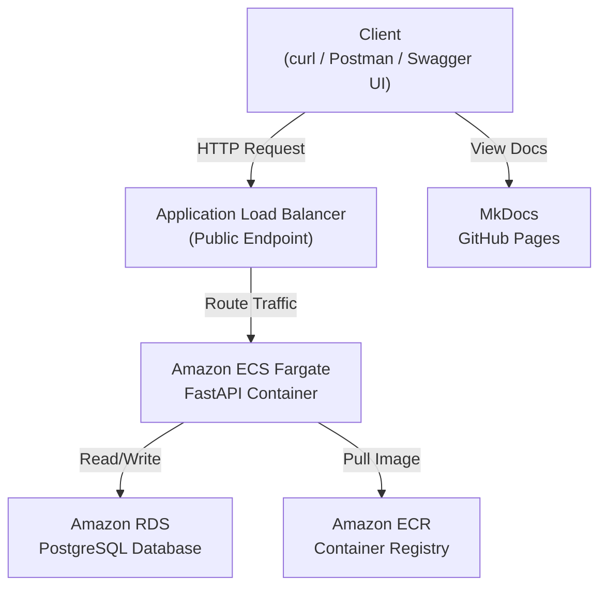

# Architecture

This document describes the high-level architecture of the Partner Catalog API, including its components, data flow, and key design decisions.

---

## System Overview

The Partner Catalog API is a layered REST application designed to:

* Ingest partner product feeds (CSV)
* Validate feed structure and content
* Track processing using job resources
* Persist data in a relational database
* Expose product data through queryable endpoints

The system is designed to simulate real-world ingestion pipelines while maintaining a clean separation between API, data access, and persistence layers.

---

## Architecture Diagram

The following diagram illustrates the high-level system architecture and request flow:


This architecture separates compute, storage, and networking concerns, enabling scalable and fault-tolerant API deployment.

## Architecture Layers

```text
Client (curl / Postman / Swagger UI)
        ↓
Router Layer (FastAPI endpoints)
        ↓
Application / Data Access Layer (db.py)
        ↓
Database (PostgreSQL / SQLite for local)
```

---

## Router Layer (`routers/`)

The router layer is responsible for handling HTTP interactions and orchestrating application behavior.

Responsibilities:

* Request/response handling
* Input validation using FastAPI and Pydantic
* API key authentication
* Routing requests to the data access layer

Example endpoints:

* `POST /feeds/upload`
* `GET /feeds/{feed_id}`
* `GET /jobs/{job_id}`
* `GET /products`

---

## Application / Data Access Layer (`db.py`)

This layer encapsulates all persistence and data transformation logic.

Responsibilities:

* Managing database connections (SQLite for local development, PostgreSQL in production)
* Performing CRUD operations
* Generating structured identifiers
* Implementing filtering, sorting, and pagination
* Mapping database records to API response schemas

This separation isolates business and persistence logic from HTTP concerns, improving maintainability and testability.

---

## Database Layer (PostgreSQL / SQLite)

The database layer provides persistent storage for all system data.

Stored entities include:

* Feed metadata
* Job metadata
* Product records
* Identifier counters

Core tables:

* `feeds`
* `jobs`
* `products`
* `id_counters`

PostgreSQL is used in production (Amazon RDS), while SQLite is used for local development.

---

## Data Flow

### Feed Ingestion Workflow

```text
Client
  ↓
POST /feeds/upload
  ↓
Validate file (CSV structure + content)
  ↓
Generate IDs (FDxxxxx, JSxxxxx, JVxxxxx)
  ↓
Persist feed (feeds table)
  ↓
Persist submission job (jobs table)
  ↓
Persist validation job (jobs table)
  ↓
Parse and store products (products table)
  ↓
Return response to client
```

---

### Product Query Workflow

```text
Client
  ↓
GET /products
  ↓
Apply filters, sorting, pagination
  ↓
Query database
  ↓
Map DB fields → API response schema
  ↓
Return response (items + next_cursor)
```

---

## Identifier Strategy

The API uses structured identifiers to ensure traceability and consistency across resources.

| Prefix | Resource       | Example |
| ------ | -------------- | ------- |
| FD     | Feed           | FD00001 |
| JS     | Submission Job | JS00001 |
| JV     | Validation Job | JV00001 |
| PR     | Product        | PR00001 |

Identifiers are generated using a database-backed counter to ensure uniqueness and persistence across restarts.

---

## Data Mapping Strategy

The system separates internal storage models from external API representations.

### Example

| Layer        | Field Name  |
| ------------ | ----------- |
| Database     | `filename`  |
| API Response | `file_name` |

This mapping approach:

* Maintains consistent API naming conventions (`snake_case`)
* Allows internal schema flexibility
* Decouples storage from presentation

---

## Job Model

Each feed submission generates two job resources:

### Submission Job (`JSxxxxx`)

* Tracks ingestion processing
* Typically completes immediately

### Validation Job (`JVxxxxx`)

* Validates CSV structure and content
* Determines feed readiness

Although jobs execute synchronously, they are modeled as asynchronous processes to support future extensibility.

---

## Deployment Architecture (AWS)

The application is deployed using a container-based architecture on AWS:

* **Amazon ECS Fargate** runs the containerized FastAPI application
* **Amazon RDS (PostgreSQL)** provides persistent relational storage
* **Application Load Balancer (ALB)** exposes a public endpoint and routes traffic
* **Amazon ECR** stores and versions container images

This architecture enables scalable, fault-tolerant operation without managing underlying infrastructure.

---

## Reliability and Health Monitoring

* ECS maintains the desired number of running tasks
* The load balancer performs health checks to route traffic only to healthy instances
* Failed containers are automatically replaced
* Database availability is managed by Amazon RDS

---

## Documentation and Developer Experience

* Interactive API documentation is available via Swagger UI (`/docs`)
* Static documentation is generated with MkDocs and hosted on GitHub Pages
* Consistent request and response formats improve usability for API consumers

---

## Design Decisions

### Separation of Concerns

* Router layer handles HTTP interactions
* Data layer handles persistence and transformation
* Database layer manages storage

This separation improves maintainability, scalability, and testability.

---

### Relational Persistence

* SQLite for local development
* PostgreSQL (RDS) for production

This approach provides a lightweight local setup while maintaining production realism.

---

### Cursor-Based Pagination

* Uses `product_id` as a cursor
* Avoids performance limitations of offset-based pagination
* Supports efficient traversal of large datasets

---

### Synchronous Execution with Asynchronous Modeling

* Jobs execute immediately
* Modeled as asynchronous to support future background processing

---

### Consistent API Design

* `snake_case` field naming
* Predictable resource structures
* Structured identifiers for traceability

---

### Cloud-Native Deployment

* Containerized application (Docker)
* Serverless compute via ECS Fargate
* Managed database (RDS)
* Public access via ALB

---

## Future Enhancements

The architecture supports future evolution, including:

* True asynchronous job processing (queues and workers)
* Advanced filtering (ranges, full-text search)
* Event-driven ingestion pipelines
* Horizontal scaling with multiple ECS tasks
* Read replicas for database scaling
* Infrastructure as Code (CloudFormation or Terraform)

---

## Project Structure

```text
app/
  main.py
  db.py
  security.py
  settings.py
  routers/
    feeds.py
    jobs.py
    products.py
  schemas/
    feeds.py
    jobs.py
    products.py
    common.py
  docs/
    *.md
```

---

## Related Documentation

* [Index](index.md)
* [Feeds API](feeds.md)
* [Jobs API](jobs.md)
* [Products API](products.md)
* [Workflows](workflows.md)
* [Errors](errors.md)

For deployment evidence, see [Screenshots](screenshots.md).
