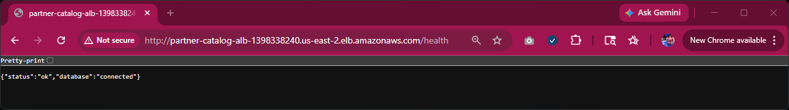
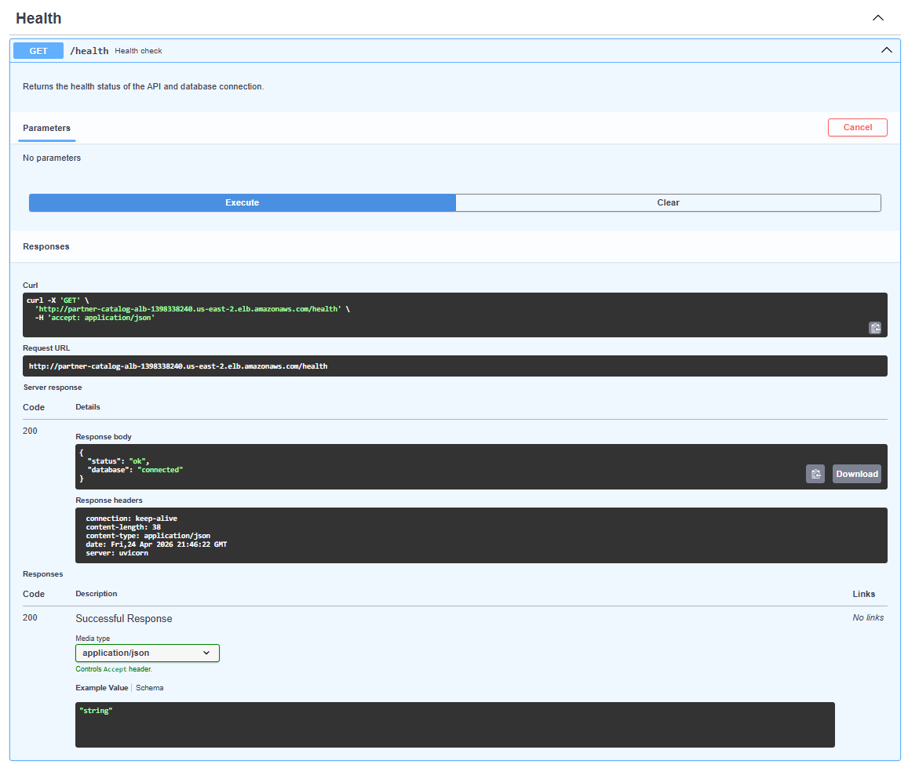
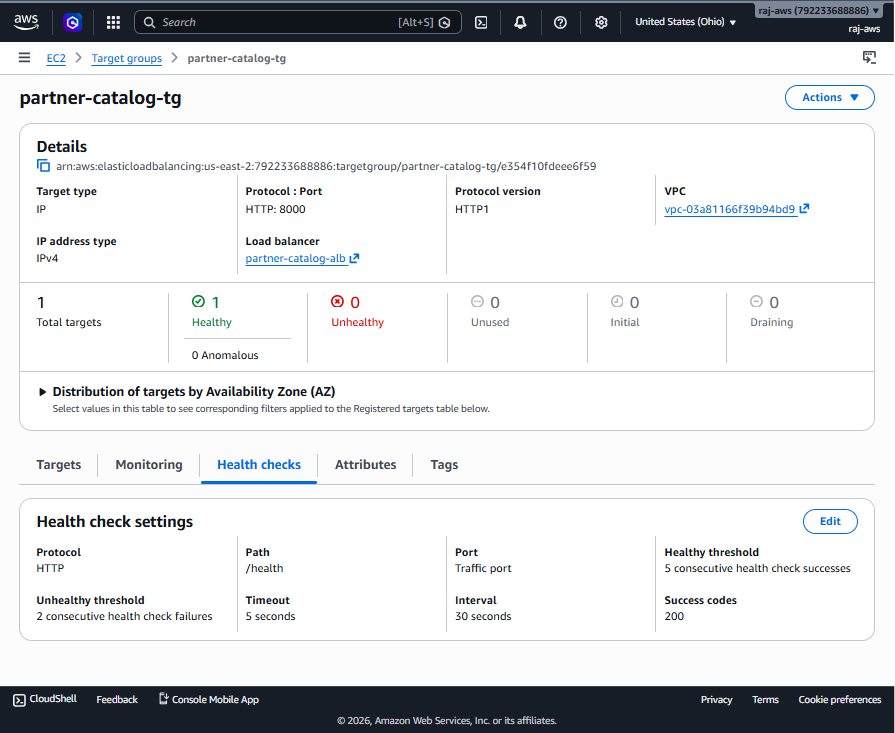

# Screenshots

This section provides visual evidence of the Partner Catalog API running in a production-style AWS environment. The application is containerized with Docker, deployed on Amazon ECS Fargate, and backed by a PostgreSQL database hosted on Amazon RDS. Public access is provided through an Application Load Balancer.

## Live API Documentation

  

## Health Check Endpoint

The `/health` endpoint verifies API availability and database connectivity. The Application Load Balancer uses this endpoint for target group health checks.

### Path

  

### Endpoint

  

## ECS Task Definition and Container Configuration
The task definition specifies the container image from Amazon ECR and runtime configuration, including environment variables used for database connectivity.

### Deployment

  

### Performance Monitoring

  

### Tasks

  

## ECS Task Definition

  

## Container Details

  

## Amazon ECR Repository
The container image for the API is stored in Amazon Elastic Container Registry and used by ECS during deployment.

  

## Application Load Balancer

### Rules and Listeners

  

### Network Mapping

  

## Target Group Health Checks
The target group monitors the health of running tasks using an HTTP health check endpoint to ensure traffic is only routed to healthy containers.

  

## Amazon RDS PostgreSQL Database
The API persists data in a PostgreSQL database hosted on Amazon RDS, providing managed storage and availability.

  

## MkDocs Documentation Site
Project documentation is generated using MkDocs and hosted via GitHub Pages.
