# Screenshots

This section provides visual evidence of the Partner Catalog API running in a production-style AWS environment. The application is containerized with Docker, deployed on Amazon ECS Fargate, and backed by a PostgreSQL database hosted on Amazon RDS. Public access is provided through an Application Load Balancer.

## Live API Documentation
The API is exposed through a public load balancer and provides interactive documentation via Swagger UI.
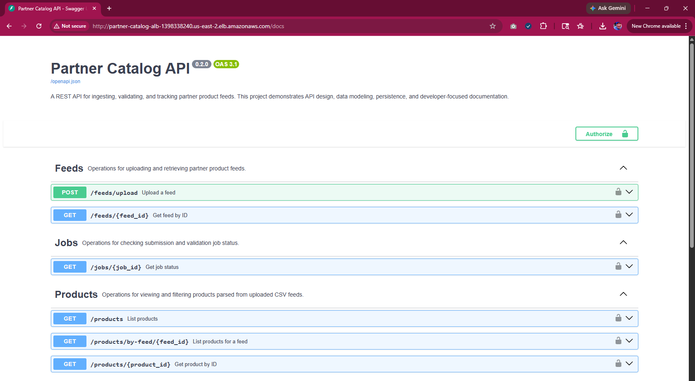

## ECS Task Definition and Container Configuration
The task definition specifies the container image from Amazon ECR and runtime configuration, including environment variables used for database connectivity.

### Deployment
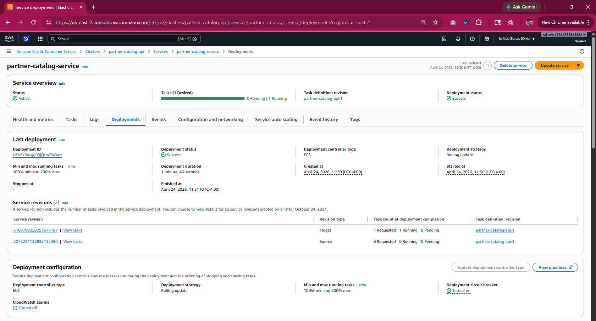

### Performance Monitoring
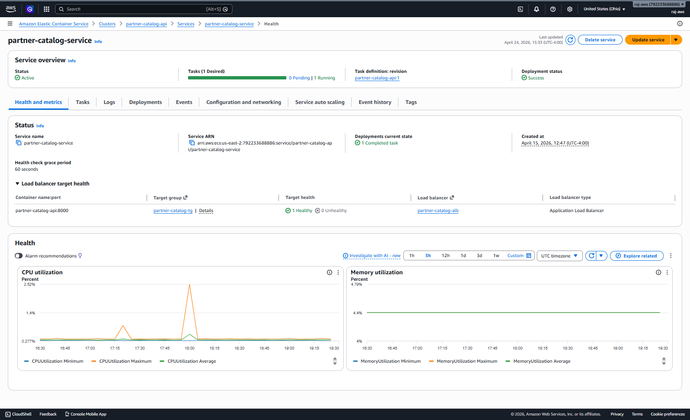

### Tasks
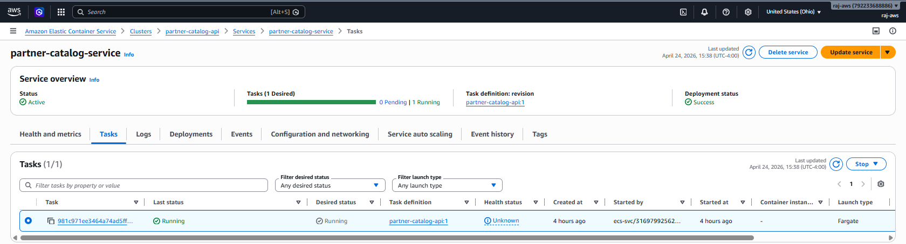

## ECS Task Definition
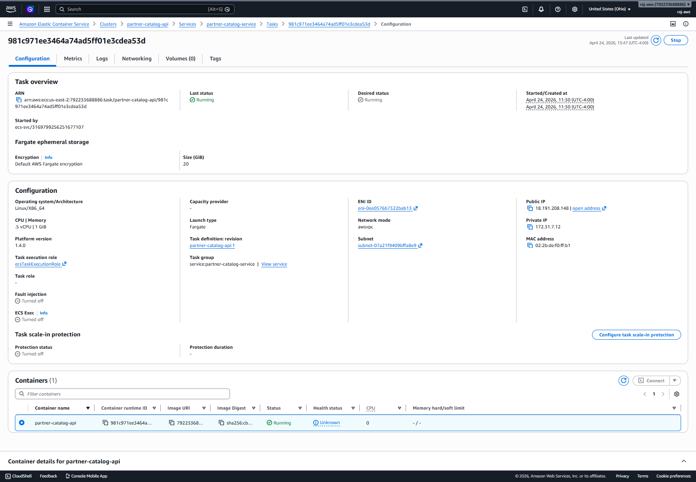

## Container Details
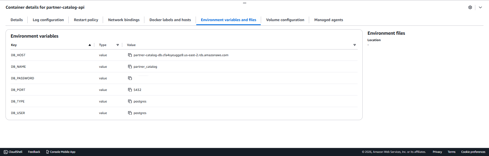

## Amazon ECR Repository
The container image for the API is stored in Amazon Elastic Container Registry and used by ECS during deployment.
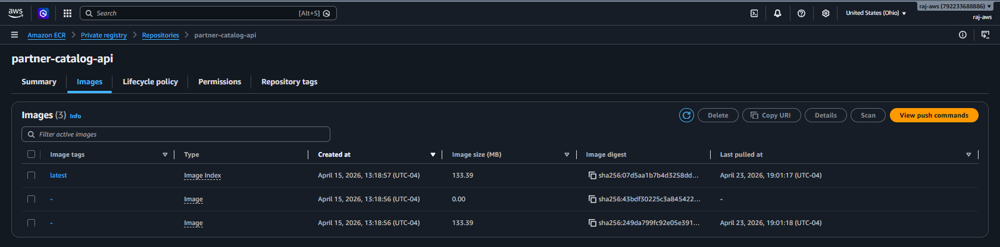

## Application Load Balancer

### Rules and Listeners
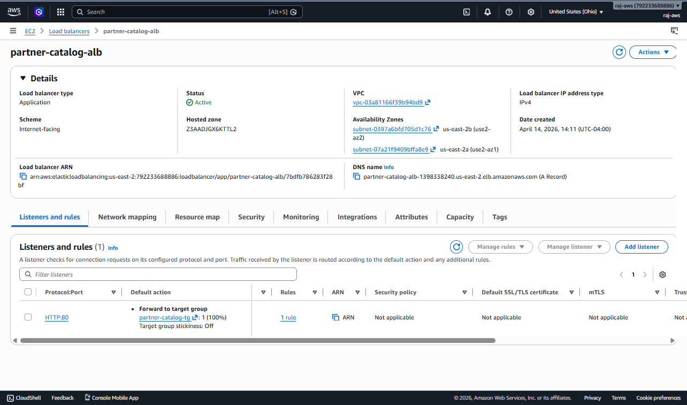

### Network Mapping
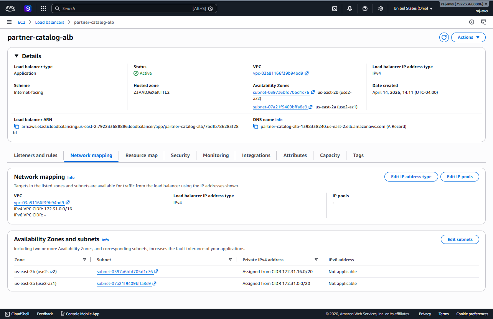

## Target Group Health Checks
The target group monitors the health of running tasks using an HTTP health check endpoint to ensure traffic is only routed to healthy containers.
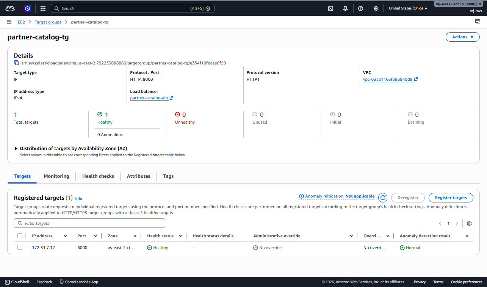

## Amazon RDS PostgreSQL Database
The API persists data in a PostgreSQL database hosted on Amazon RDS, providing managed storage and availability.
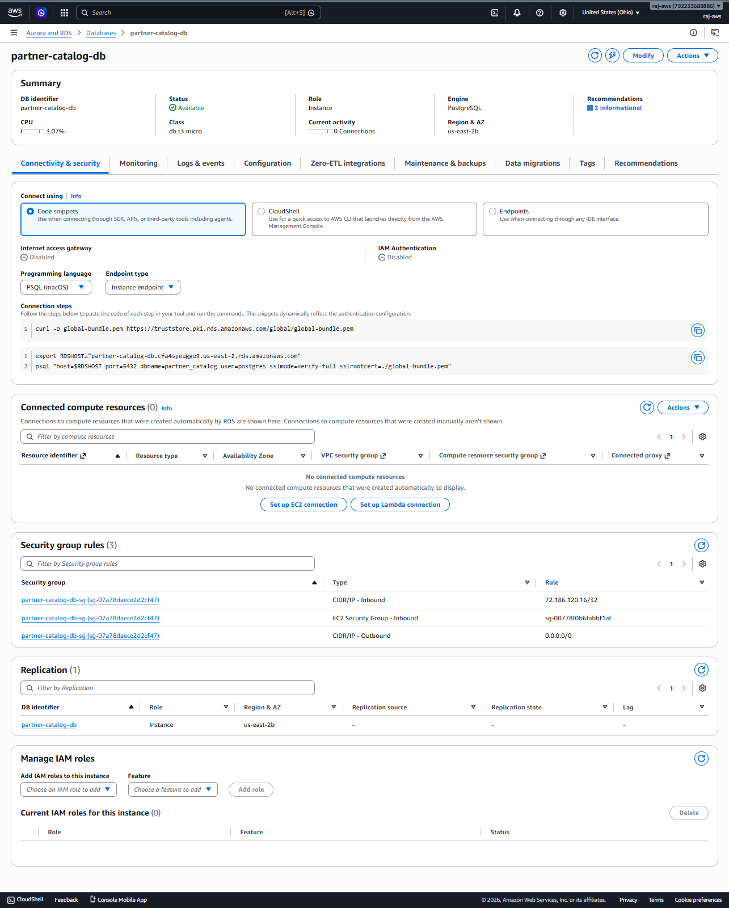

## MkDocs Documentation Site
Project documentation is generated using MkDocs and hosted via GitHub Pages.
